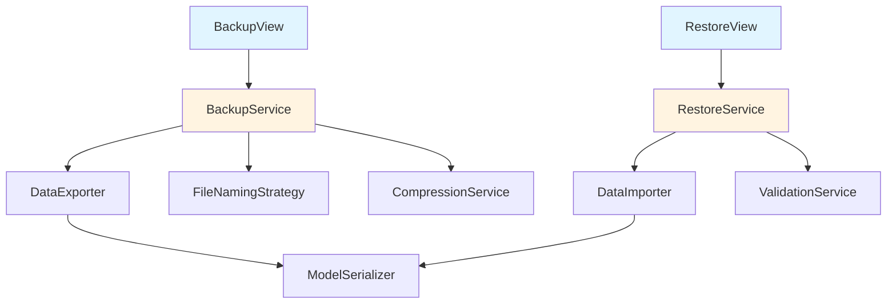

# Database Backup & Restore System Design

## Overview

This document outlines the design for a comprehensive database backup and restore system for Baby Buddy that:
- Exports all database data to JSON format in a ZIP file
- Works with any database backend (SQLite, PostgreSQL, MySQL, etc.)
- Names files using user's localized timezone (format: `MMDDYY_HHMMSS.zip`)
- Allows restoration from backup files
- Requires no modifications to existing data models

## Architecture

### Design Pattern: Strategy Pattern

The implementation uses the **Strategy Pattern** to handle different aspects of backup/restore operations:



### Key Components

#### 1. **BackupService** (`babybuddy/services/backup.py`)
Central service orchestrating the backup process:
- Discovers all models dynamically using Django's app registry
- Serializes data to JSON using Django's natural serialization
- Creates timestamped filename based on user timezone
- Compresses data into ZIP format
- Handles media files (optional)

#### 2. **RestoreService** (`babybuddy/services/restore.py`)
Central service orchestrating the restore process:
- Validates backup file structure
- Deserializes JSON data
- Handles foreign key dependencies
- Performs atomic transactions
- Provides rollback on errors

#### 3. **Views** (`babybuddy/views.py`)
- `BackupDownloadView`: Generates and streams backup ZIP file
- `RestoreUploadView`: Handles backup file upload and restoration
- `BackupHistoryView`: Shows backup/restore history (optional)

#### 4. **Forms** (`babybuddy/forms.py`)
- `RestoreForm`: File upload form with validation

## Detailed Implementation Plan

### Phase 1: Core Backup Service

#### File: `babybuddy/services/__init__.py`
```python
# Empty file to make services a package
```

#### File: `babybuddy/services/backup.py`

**Key Classes:**

1. **`BackupService`**
   - `create_backup(user)` → Returns HttpResponse with ZIP file
   - `_get_all_models()` → Discovers all Django models
   - `_serialize_model_data(model)` → Converts model data to JSON
   - `_create_filename(timezone_str)` → Generates timestamped filename
   - `_create_zip_archive(data_dict)` → Creates ZIP with JSON files

2. **`ModelDataSerializer`**
   - Uses Django's `serializers.serialize('json', queryset)`
   - Handles special fields (JSONField, FileField, ImageField)
   - Preserves relationships using natural keys

**Data Structure:**
```
backup_MMDDYY_HHMMSS.zip
├── metadata.json          # Backup metadata (timestamp, version, db type)
├── auth/
│   ├── user.json
│   └── group.json
├── core/
│   ├── child.json
│   ├── feeding.json
│   ├── sleep.json
│   ├── diaperchange.json
│   └── ...
├── babybuddy/
│   ├── settings.json
│   └── tag.json
└── media/                 # Optional: user uploaded files
    └── ...
```

**Metadata Format:**
```json
{
  "version": "1.0",
  "timestamp": "2025-12-20T23:35:47-05:00",
  "database_engine": "django.db.backends.postgresql",
  "babybuddy_version": "2.0.0",
  "models_count": 15,
  "total_records": 1234,
  "includes_media": false
}
```

### Phase 2: Core Restore Service

#### File: `babybuddy/services/restore.py`

**Key Classes:**

1. **`RestoreService`**
   - `restore_from_backup(file, user)` → Restores database from ZIP
   - `_validate_backup_file(file)` → Validates ZIP structure
   - `_extract_and_parse(file)` → Extracts and parses JSON files
   - `_determine_load_order(models)` → Orders models by dependencies
   - `_restore_model_data(model, data)` → Restores single model
   - `_handle_media_files(zip_file)` → Restores media files

2. **`DependencyResolver`**
   - Analyzes model relationships (ForeignKey, ManyToMany)
   - Creates dependency graph
   - Returns topologically sorted model list

3. **`BackupValidator`**
   - Validates JSON structure
   - Checks version compatibility
   - Verifies data integrity

**Restore Process:**
1. Validate backup file structure
2. Parse metadata.json
3. Begin database transaction
4. Disable signals temporarily
5. Clear existing data (optional, with confirmation)
6. Load models in dependency order
7. Re-enable signals
8. Commit transaction
9. Restore media files

### Phase 3: Views and URLs

#### File: `babybuddy/views.py` (additions)

**Views:**

1. **`BackupDownloadView(LoginRequiredMixin, StaffOnlyMixin, View)`**
   ```python
   def get(self, request):
       # Get user timezone from request.user.settings.timezone
       # Create backup using BackupService
       # Return streaming response with ZIP file
   ```

2. **`RestoreUploadView(LoginRequiredMixin, StaffOnlyMixin, FormView)`**
   ```python
   def form_valid(self, form):
       # Validate uploaded file
       # Show confirmation page with backup details
       # On confirmation, restore using RestoreService
   ```

3. **`RestoreConfirmView(LoginRequiredMixin, StaffOnlyMixin, View)`**
   ```python
   def post(self, request):
       # Perform actual restore
       # Show success/error message
   ```

#### File: `babybuddy/urls.py` (additions)

```python
app_patterns = [
    # ... existing patterns ...
    path("backup/download/", views.BackupDownloadView.as_view(), name="backup-download"),
    path("backup/restore/", views.RestoreUploadView.as_view(), name="backup-restore"),
    path("backup/restore/confirm/", views.RestoreConfirmView.as_view(), name="backup-restore-confirm"),
]
```

### Phase 4: Forms and Templates

#### File: `babybuddy/forms.py` (additions)

```python
class RestoreForm(forms.Form):
    backup_file = forms.FileField(
        label=_("Backup File"),
        help_text=_("Select a backup ZIP file to restore"),
        validators=[FileExtensionValidator(allowed_extensions=['zip'])]
    )
    clear_existing_data = forms.BooleanField(
        label=_("Clear existing data before restore"),
        required=False,
        initial=False,
        help_text=_("WARNING: This will delete all existing data!")
    )
```

#### File: `babybuddy/templates/babybuddy/backup_restore.html`

Template for backup/restore interface with:
- Download backup button
- Upload restore file form
- Warning messages
- Progress indicators

#### File: `babybuddy/templates/babybuddy/restore_confirm.html`

Confirmation page showing:
- Backup metadata
- Number of records to restore
- Warning about data loss
- Confirm/Cancel buttons

### Phase 5: Filename Generation

#### File: `babybuddy/services/filename.py`

```python
class BackupFilenameGenerator:
    @staticmethod
    def generate(user_timezone: str) -> str:
        """
        Generate filename: backup_MMDDYY_HHMMSS.zip
        Based on user's timezone from user.settings.timezone
        """
        tz = pytz.timezone(user_timezone)
        now = timezone.now().astimezone(tz)
        return f"backup_{now.strftime('%m%d%y_%H%M%S')}.zip"
```

## Technical Considerations

### 1. Database Agnostic Approach

**Why it works:**
- Uses Django ORM exclusively
- Django's serialization framework handles all database types
- No raw SQL queries
- Natural keys for relationships

**Supported Databases:**
- SQLite (default)
- PostgreSQL
- MySQL/MariaDB
- Oracle
- Any Django-supported database

### 2. Model Discovery

```python
from django.apps import apps

def get_all_models():
    """Get all models from all installed apps"""
    models = []
    for app_config in apps.get_app_configs():
        models.extend(app_config.get_models())
    return models
```

**Excluded Models:**
- Django's built-in session models
- Migration history
- Cache tables
- ContentType (auto-regenerated)

### 3. Dependency Resolution

**Algorithm:**
```python
def resolve_dependencies(models):
    """
    Topological sort based on ForeignKey relationships
    Ensures parent models are loaded before children
    """
    # Build dependency graph
    graph = {}
    for model in models:
        deps = get_foreign_key_models(model)
        graph[model] = deps
    
    # Topological sort
    return topological_sort(graph)
```

### 4. Transaction Safety

```python
from django.db import transaction

@transaction.atomic
def restore_data(data):
    """
    All-or-nothing restore
    Rollback on any error
    """
    try:
        for model_data in data:
            restore_model(model_data)
    except Exception as e:
        # Transaction automatically rolls back
        raise RestoreError(f"Restore failed: {e}")
```

### 5. Signal Handling

During restore, temporarily disable signals to prevent:
- Duplicate notifications
- Unnecessary calculations
- Side effects

```python
from django.db.models.signals import post_save, pre_save

# Disable signals
post_save.disconnect(receiver, sender=Model)

# Restore data
restore_data()

# Re-enable signals
post_save.connect(receiver, sender=Model)
```

### 6. Memory Efficiency

For large databases:
- Stream data in chunks
- Use iterator() for querysets
- Write directly to ZIP without intermediate files

```python
def serialize_large_model(model):
    """Serialize in chunks to avoid memory issues"""
    chunk_size = 1000
    queryset = model.objects.all()
    
    for i in range(0, queryset.count(), chunk_size):
        chunk = queryset[i:i+chunk_size]
        yield serializers.serialize('json', chunk)
```

## Security Considerations

### 1. Authentication & Authorization

- **Required Permission:** `is_staff` (staff users only)
- **Additional Check:** Can add custom permission `babybuddy.can_backup`
- **Login Required:** All views require authentication

### 2. File Validation

```python
class BackupFileValidator:
    MAX_SIZE = 100 * 1024 * 1024  # 100MB
    ALLOWED_EXTENSIONS = ['.zip']
    
    def validate(self, file):
        # Check file size
        if file.size > self.MAX_SIZE:
            raise ValidationError("File too large")
        
        # Check extension
        if not file.name.endswith('.zip'):
            raise ValidationError("Invalid file type")
        
        # Check ZIP integrity
        if not zipfile.is_zipfile(file):
            raise ValidationError("Invalid ZIP file")
        
        # Check for malicious paths
        with zipfile.ZipFile(file) as zf:
            for name in zf.namelist():
                if name.startswith('/') or '..' in name:
                    raise ValidationError("Invalid file paths")
```

### 3. Data Sanitization

- Validate all JSON data before deserialization
- Use Django's built-in validators
- Sanitize file paths for media files

### 4. Audit Logging

```python
class BackupAuditLog(models.Model):
    user = models.ForeignKey(User, on_delete=models.CASCADE)
    action = models.CharField(max_length=20)  # 'backup' or 'restore'
    timestamp = models.DateTimeField(auto_now_add=True)
    success = models.BooleanField()
    details = models.JSONField()
```

## User Interface Integration

### 1. Navigation Menu

Add to user menu (for staff users):
```
Settings
├── User Settings
├── Site Settings
├── Database Admin
└── Backup & Restore  ← NEW
```

### 2. Backup Page Layout

```
┌─────────────────────────────────────────┐
│ Database Backup & Restore               │
├─────────────────────────────────────────┤
│                                         │
│ Create Backup                           │
│ ┌─────────────────────────────────────┐ │
│ │ Download a complete backup of all   │ │
│ │ your Baby Buddy data.               │ │
│ │                                     │ │
│ │ [Download Backup]                   │ │
│ └─────────────────────────────────────┘ │
│                                         │
│ Restore from Backup                     │
│ ┌─────────────────────────────────────┐ │
│ │ Upload a backup file to restore     │ │
│ │ your data.                          │ │
│ │                                     │ │
│ │ [Choose File] [Upload]              │ │
│ │                                     │ │
│ │ ⚠️  Warning: This may overwrite     │ │
│ │    existing data!                   │ │
│ └─────────────────────────────────────┘ │
└─────────────────────────────────────────┘
```

### 3. Progress Indicators

- Show spinner during backup generation
- Progress bar during restore (if possible)
- Success/error messages using Django messages framework

## Error Handling

### Backup Errors

```python
class BackupError(Exception):
    """Base exception for backup errors"""
    pass

class SerializationError(BackupError):
    """Error during data serialization"""
    pass

class CompressionError(BackupError):
    """Error during ZIP creation"""
    pass
```

### Restore Errors

```python
class RestoreError(Exception):
    """Base exception for restore errors"""
    pass

class ValidationError(RestoreError):
    """Invalid backup file"""
    pass

class DataIntegrityError(RestoreError):
    """Data integrity check failed"""
    pass

class DependencyError(RestoreError):
    """Dependency resolution failed"""
    pass
```

### User-Friendly Messages

```python
ERROR_MESSAGES = {
    'backup_failed': _("Failed to create backup. Please try again."),
    'restore_failed': _("Failed to restore backup. Your data has not been changed."),
    'invalid_file': _("Invalid backup file. Please select a valid backup ZIP file."),
    'version_mismatch': _("This backup was created with a different version of Baby Buddy."),
}
```

## Testing Strategy

### Unit Tests

1. **BackupService Tests**
   - Test model discovery
   - Test serialization
   - Test filename generation
   - Test ZIP creation

2. **RestoreService Tests**
   - Test file validation
   - Test deserialization
   - Test dependency resolution
   - Test transaction rollback

3. **View Tests**
   - Test authentication
   - Test authorization
   - Test file upload
   - Test download

### Integration Tests

1. **Full Backup/Restore Cycle**
   - Create test data
   - Generate backup
   - Clear database
   - Restore from backup
   - Verify data integrity

2. **Cross-Database Tests**
   - Test with SQLite
   - Test with PostgreSQL
   - Verify compatibility

### Edge Cases

- Empty database
- Very large database
- Corrupted backup file
- Partial backup file
- Version mismatches
- Missing dependencies

## Performance Optimization

### 1. Lazy Loading

```python
def backup_generator(models):
    """Generate backup data lazily"""
    for model in models:
        yield serialize_model(model)
```

### 2. Streaming Response

```python
def stream_backup(request):
    """Stream ZIP file without loading into memory"""
    response = StreamingHttpResponse(
        backup_generator(),
        content_type='application/zip'
    )
    response['Content-Disposition'] = f'attachment; filename="{filename}"'
    return response
```

### 3. Compression Level

```python
# Use faster compression for large databases
compression = zipfile.ZIP_DEFLATED
compression_level = 6  # Balance between speed and size
```

## Future Enhancements

### Phase 2 Features (Optional)

1. **Scheduled Backups**
   - Celery task for automatic backups
   - Configurable schedule
   - Email notifications

2. **Cloud Storage Integration**
   - Upload to S3/Google Cloud/Azure
   - Automatic retention policies
   - Encrypted backups

3. **Incremental Backups**
   - Only backup changed data
   - Smaller file sizes
   - Faster backup times

4. **Selective Restore**
   - Restore specific models
   - Restore specific date ranges
   - Merge with existing data

5. **Backup History**
   - List of previous backups
   - Metadata display
   - Quick restore from history

## File Structure Summary

```
babybuddy/
├── services/
│   ├── __init__.py
│   ├── backup.py           # BackupService, ModelDataSerializer
│   ├── restore.py          # RestoreService, DependencyResolver
│   ├── filename.py         # BackupFilenameGenerator
│   └── validators.py       # BackupValidator, BackupFileValidator
├── views.py                # Add: BackupDownloadView, RestoreUploadView, RestoreConfirmView
├── urls.py                 # Add: backup/restore URLs
├── forms.py                # Add: RestoreForm
├── models.py               # Add: BackupAuditLog (optional)
└── templates/
    └── babybuddy/
        ├── backup_restore.html
        └── restore_confirm.html
```

## Implementation Checklist

- [ ] Create `babybuddy/services/` package
- [ ] Implement `BackupService` class
- [ ] Implement `RestoreService` class
- [ ] Implement `BackupFilenameGenerator`
- [ ] Implement `DependencyResolver`
- [ ] Implement `BackupValidator`
- [ ] Create `BackupDownloadView`
- [ ] Create `RestoreUploadView`
- [ ] Create `RestoreConfirmView`
- [ ] Create `RestoreForm`
- [ ] Create backup/restore templates
- [ ] Add URL patterns
- [ ] Add navigation menu items
- [ ] Write unit tests
- [ ] Write integration tests
- [ ] Add documentation
- [ ] Test with different databases
- [ ] Test with large datasets
- [ ] Add audit logging (optional)
- [ ] Add progress indicators (optional)

## Conclusion

This design provides a robust, database-agnostic backup and restore system that:

✅ Works with any Django-supported database  
✅ Requires no model modifications  
✅ Uses user's timezone for filenames  
✅ Provides atomic transactions  
✅ Handles dependencies correctly  
✅ Includes comprehensive error handling  
✅ Follows Django best practices  
✅ Uses proven design patterns  
✅ Scales to large databases  
✅ Maintains data integrity  

The implementation is modular, testable, and maintainable, following the existing Baby Buddy code structure and conventions.
